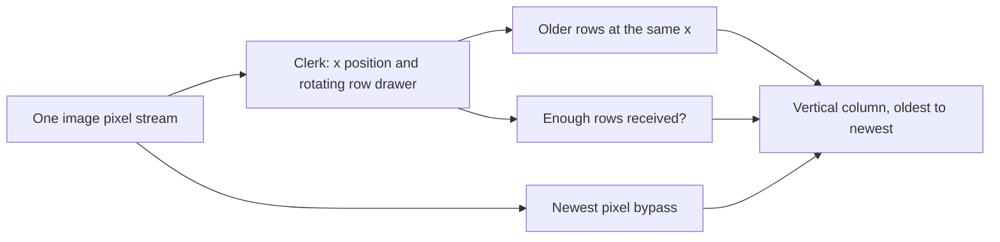
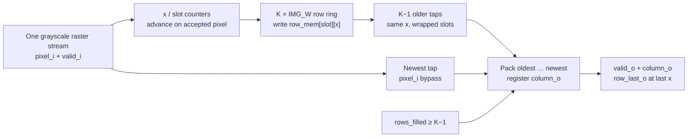

# Circular Row Buffer
#implemented

[[Home]] · [[Module Blocks.canvas|Module blocks]] · [[Image Line Buffers]] · [[Single SAD Engine]] · [[Testbench Guide]]

Source: [rtl/circular_row_buffer.sv](rtl/circular_row_buffer.sv). Bench: [tb_circular_row_buffer.sv](tests/rtl/tb_circular_row_buffer.sv).

## First, the story — no RTL yet

Imagine a filing cabinet with eleven full-row drawers and a clerk walking across an image one pixel at a time. The clerk drops each new pixel into the drawer assigned to the current image row. At a given horizontal position, the cabinet still holds pixels from earlier rows at that same position. Once enough rows have arrived, the clerk reads the ten older pixels and adds the just-arrived pixel as the newest: that bundle is one **vertical column**. At the end of the image row, the clerk returns to the left edge and rotates to the next drawer. Eventually the drawers circle back and old rows are overwritten. An input pause leaves the clerk standing in place; an abort returns the clerk to the start and requires enough fresh rows before any bundle can be trusted again.

This cabinet works for **one grayscale image only**. It neither pairs two images nor calculates differences or the SAD score. An end-of-output-row sign tells a future controller when to drain the downstream engine; the cabinet itself does not wait.



**Map for reading code:** drawer → `row_mem`; clerk position → `x`/`slot`; fresh-row count → `rows_filled`; newest bypass → `pixel_i`; resulting bundle → `column_o`; end-of-row sign → `row_last_o`. Below, every important statement is traced back to this picture.

## What this abstraction is

One grayscale stream. Pixels arrive left to right, then the next row. The module keeps **K row slots in a ring** and, once those rows overlap, emits the vertical column at the current x.

It does **not** pair left and right images, shift a disparity, pad borders, or compute SAD. Use two instances later. A future controller must drain [[Single SAD Engine]] after `row_last_o` before the next window-row; this module does not insert that gap.

## Complete source

```systemverilog
`timescale 1ns/1ps
`default_nettype none

// One image, raster order. A ring of K row slots emits one vertical column
// per accepted pixel once K rows overlap at that x.
// Window row 0 is the oldest and occupies [0 +: PIXEL_W]; row K-1 is pixel_i.
// Accepted at edge t -> registered column after that edge. No backpressure.
// clear_i drops the cursor and the output. Slots are never read until rewritten.
// This is not disparity alignment, pairing, or the SAD engine. Instantiate twice.
// row_last_o marks the last x of a complete window-row. A later controller must
// drain the engine before the next row; this module does not insert that gap.
module circular_row_buffer #(
    parameter integer K = 11,
    parameter integer PIXEL_W = 8,
    parameter integer IMG_W = 640
) (
    input  wire                       clk,
    input  wire                       rst_n,
    input  wire                       clear_i,
    input  wire                       valid_i,
    input  wire [PIXEL_W-1:0]         pixel_i,
    output logic                      valid_o,
    output logic                      row_last_o,
    output logic [K*PIXEL_W-1:0]      column_o
);
    localparam integer X_W = (IMG_W <= 1) ? 1 : $clog2(IMG_W);
    localparam integer SLOT_W = (K <= 1) ? 1 : $clog2(K);
    localparam integer COUNT_W = $clog2(K + 1);

    // Functional row store. Combinational column readout is the abstraction;
    // mapping each row to synchronous RAM is a later fitting pass.
    logic [PIXEL_W-1:0] row_mem [0:K-1][0:IMG_W-1];
    logic [X_W-1:0] x;
    logic [SLOT_W-1:0] slot;
    logic [COUNT_W-1:0] rows_filled;
    wire window_ready = (rows_filled >= COUNT_W'(K - 1));

    wire [K*PIXEL_W-1:0] column_next;
    genvar j;
    generate
        for (j = 0; j < K; j = j + 1) begin : g_tap
            if (j == K - 1) begin : g_newest
                assign column_next[j*PIXEL_W +: PIXEL_W] = pixel_i;
            end else begin : g_older
                // slot is 0..K-1 and this offset is 1..K-1, so one subtract wraps it.
                // A wide % would make Quartus infer a divider.
                wire [SLOT_W:0] tap_sum = {1'b0, slot} + (SLOT_W + 1)'(j + 1);
                wire [SLOT_W:0] tap_slot = (tap_sum >= (SLOT_W + 1)'(K))
                    ? tap_sum - (SLOT_W + 1)'(K) : tap_sum;
                assign column_next[j*PIXEL_W +: PIXEL_W] =
                    row_mem[tap_slot[SLOT_W-1:0]][x];
            end
        end
    endgenerate

    always_ff @(posedge clk) begin
        if (!rst_n || clear_i) begin
            x <= '0;
            slot <= '0;
            rows_filled <= '0;
            valid_o <= 1'b0;
            row_last_o <= 1'b0;
            column_o <= '0;
        end else begin
            valid_o <= 1'b0;
            row_last_o <= 1'b0;
            if (valid_i) begin
                row_mem[slot][x] <= pixel_i;
                if (window_ready) begin
                    valid_o <= 1'b1;
                    row_last_o <= (x == IMG_W - 1);
                    column_o <= column_next;
                end
                if (x == IMG_W - 1) begin
                    x <= '0;
                    if (K == 1) slot <= '0;
                    else if (slot == K - 1) slot <= '0;
                    else slot <= slot + 1'b1;
                    if (rows_filled < K) rows_filled <= rows_filled + 1'b1;
                end else begin
                    x <= x + 1'b1;
                end
            end
        end
    end

    // synthesis translate_off
    initial begin
        if (K < 1 || PIXEL_W < 1 || IMG_W < 1)
            $fatal(1, "K, PIXEL_W and IMG_W must be positive");
    end
    // synthesis translate_on
endmodule
`default_nettype wire
```

## Line-by-line mapping from filing-cabinet story to RTL

Line numbers below refer to [rtl/circular_row_buffer.sv](rtl/circular_row_buffer.sv). The row buffer is a **separate** module from both the calculator and the column-sum history.

| Source line(s) | What the statement does | Story / hardware mapping |
|---|---|---|
| 1–2 | Sets simulation precision and rejects implicit nets. | Time units and typo protection; neither creates a drawer. |
| 4–11 | Specifies one-image raster order, oldest/newest packing, same-edge registered output, and downstream drain responsibility. | Defines the clerk's job and explicitly excludes disparity pairing and engine scheduling. |
| 12–16 | Fixes K, pixel width and row width at elaboration; starts the port list. | Determines number of drawers, number of positions per drawer, and bits per pixel. |
| 17–20 | Declares clock, synchronous active-low reset, clear and valid input. | The clerk moves only for an accepted pixel; abort resets the clerk's position. |
| 21–25 | Declares input pixel, valid output, last-column marker and packed K-row column output. | One newly delivered card becomes the newest item of an emitted vertical bundle. |
| 26 | Computes a nonzero-width x counter even for a one-pixel row. | The clerk always has a representable horizontal position. |
| 27 | Computes a nonzero-width row slot even when K=1. | A one-drawer cabinet remains legal hardware. |
| 28 | Sizes the number-of-completed-rows counter. | The clerk can represent the fully warmed-up state. |
| 30–36 | Declares K×IMG_W storage, x, rotating slot, filled count; enables output after K−1 completed rows. | The cabinet holds previous rows; only after enough drawers have fresh rows can one complete bundle be emitted. |
| 38–43 | Creates packed candidate column and one parallel tap per output row; latest tap takes `pixel_i`. | The current drawer still has an old row, so the just-delivered pixel bypasses storage. |
| 44–51 | For an older tap, widens `slot+j+1`, conditionally subtracts K and reads the chosen drawer at x. | Walk around the circular drawers without a divider; all older pixels come from the **same horizontal position**. |
| 52–54 | Closes the conditional tap and generated parallel loop. | The circuit has K simultaneous taps, not K successive pixel clocks. |
| 56–64 | At a rising edge, reset/clear zeros cursor, filled count, output flags and output column. | Abort restarts the clerk; old drawer bits remain physically stored but are not trusted until fresh rows arrive. |
| 65–67 | Defaults valid and end-of-row markers low; proceeds only for `valid_i`. | Pauses leave the cursor and ring unchanged; no ghost column is produced. |
| 68 | Writes the current pixel to `row_mem[slot][x]`. | Replace one card in the current drawer; no bulk row copy occurs. |
| 69–73 | When ready, registers valid, optional last-x flag and packed candidate column. | Deliver a complete vertical bundle after this edge; `row_last_o` marks only a valid output at row end. |
| 74–82 | At the final x, wraps x, rotates slot (special-casing K=1), increments/saturates filled rows; otherwise increments x. | Finish the drawer's row, return left, rotate to the next drawer; stop counting once the cabinet is warm. |
| 83–85 | Ends the pixel-accepting and sequential blocks. | With `valid_i=0`, none of that cursor movement or row write happens. |
| 87–92 | Simulation-only guard rejects nonpositive dimensions. | Detect an impossible drawer layout during elaboration/testing without extra runtime circuitry. |
| 93–94 | Closes the module and restores normal nettype. | No hidden pipeline register is added. |

**Trace one pixel:** on an edge with `valid_i=1`, line 68 writes the pixel into the current drawer; line 43 simultaneously feeds it straight to the newest tap, while lines 44–51 select preceding rows *before* the write. Lines 69–73 register a complete column only after warmup. Lines 74–82 move x/slot for the next pixel. At a clear edge, lines 56–64 take priority over all of this; discarded pixels and previous frame rows cannot immediately generate valid output.

## Ports

| Port | Kind | Meaning |
|---|---|---|
| clk | control | Rising-edge clock |
| rst_n | control | Synchronous active-low reset |
| clear_i | control | Drop the cursor and the registered output. Wins over valid_i |
| valid_i | input | Accept pixel_i. Bubbles do not advance x |
| pixel_i | input | One grayscale pixel |
| valid_o | output | column_o is a complete K-pixel window |
| row_last_o | output | That column is the last x of a window-row. Zero when invalid |
| column_o | output | Oldest window row in the low slice. Held while invalid, except reset/clear zeros it |

Window row `j` occupies `[j*PIXEL_W +: PIXEL_W]`. Row 0 is the oldest image row in the window. Row `K-1` is the pixel just accepted.

## Timing

An accepted pixel at rising edge `t` produces its registered column after that same edge. There is no adder-tree delay here. Warmup counts **completed rows**, not clocks: the first column is the first pixel of image row `K-1`.

`row_last_o` is only asserted with `valid_o`. Ends of the warmup rows do not pulse it.

## Storage

`row_mem[slot][x]` is the functional store. The newest tap is `pixel_i`, because the slot being written still holds the pixel from K rows ago until the write lands. Older taps read the other slots at the same x. After clear, those slots are not read until this frame rewrites them.

Combinational readout of the column is intentional for this first abstraction. Quartus may map it to logic rather than M9K. A later pass can give each row a synchronous RAM without changing this port list.

The functional default is `IMG_W=640`. Analysis & Synthesis of that default did not finish within 300 seconds. `Stereo_SAD_RowBuffer.qpf` therefore synthesizes `circular_row_buffer_synth`, the same module with `IMG_W=16`. That run passed with 0 errors and 0 warnings and reported 3156 logic cells before fitting. That count is not the 640-wide design, and it is not an Fmax.

## Run

```sh
python scripts/run_tests.py --suite row
python scripts/run_tests.py --suite row --case 11:8:8 --vcd
```

The scoreboard stores a flat image and rebuilds each column from original pixels. It does not copy the ring pointer. Open **Stereo_SAD_RowBuffer.qpf** for component synthesis. See [[Module Blocks.canvas]] for the port-level interconnect.

## RTL walkthrough: row ring, tap selection, and output

The complete [rtl/circular_row_buffer.sv](rtl/circular_row_buffer.sv) source is embedded above; each excerpt below sits beside the reason for it. This is a **single-image row buffer**, distinct from the [[Column Sum Buffer - Code Walkthrough|circular column-sum history]] inside the SAD engine.

### Parameters and stream interface (source lines 1–25)

| Code | Why it is here |
|---|---|
| `` `default_nettype none `` | A misspelled signal cannot silently become an implicit wire. The final line restores the default. |
| `K=11`, `PIXEL_W=8`, `IMG_W=640` | Compile-time height of the window, grayscale pixel width, and raster row width. These are not runtime CPU controls. |
| `valid_i` and `pixel_i` | One pixel is consumed only when valid. Gaps do not change the image's x or row. |
| `column_o` and `valid_o` | Registered K-pixel vertical window and its validity. The newest pixel occupies row `K−1`; the oldest occupies row 0. |
| `row_last_o` | Pulses along with a **complete** output column at the last x of a row. It does not pause or clear the downstream engine. |

### State, storage, and warmup (source lines 26–38)

```systemverilog
localparam integer X_W = (IMG_W <= 1) ? 1 : $clog2(IMG_W);
localparam integer SLOT_W = (K <= 1) ? 1 : $clog2(K);
localparam integer COUNT_W = $clog2(K + 1);
logic [PIXEL_W-1:0] row_mem [0:K-1][0:IMG_W-1];
logic [X_W-1:0] x;
logic [SLOT_W-1:0] slot;
logic [COUNT_W-1:0] rows_filled;
wire window_ready = (rows_filled >= COUNT_W'(K - 1));
```

`x` addresses the current column; `slot` chooses which stored image row is being overwritten. `rows_filled` counts *completed* image rows, saturating at K, so a complete K-row window exists when the current pixel belongs to row `K−1` or later. The `<= 1` expressions prevent zero-width x/slot counters. `row_mem` is conceptual K×IMG_W storage; the current asynchronous read pattern **does not infer block RAM** in the smoke synthesis. Reset/clear does not zero all memory bits, because `rows_filled` prevents stale pixels from being presented until the preceding rows are overwritten. This presumes a fresh raster image starts at x=0 after clear.

### The circular tap selector (source lines 39–54)

```systemverilog
if (j == K - 1) begin : g_newest
    assign column_next[j*PIXEL_W +: PIXEL_W] = pixel_i;
end else begin : g_older
    wire [SLOT_W:0] tap_sum = {1'b0, slot} + (SLOT_W + 1)'(j + 1);
    wire [SLOT_W:0] tap_slot = (tap_sum >= (SLOT_W + 1)'(K))
        ? tap_sum - (SLOT_W + 1)'(K) : tap_sum;
    assign column_next[j*PIXEL_W +: PIXEL_W] =
        row_mem[tap_slot[SLOT_W-1:0]][x];
end
```

This `generate` loop instantiates **parallel hardware taps**, not K sequential clock steps. The slot being overwritten still contains a pixel K rows old; therefore the newest tap bypasses RAM and uses `pixel_i` directly. The oldest retained row is in the **next** slot `(slot+1) mod K`; row `j` uses `(slot+j+1) mod K`. The widened addition and conditional subtract implement this wrap without a general divider. At `K=1`, only the `g_newest` branch exists: no older-row read is needed. Every tap uses the **same x**, forming a vertical column rather than a horizontal window.

### Sequential behavior (source lines 56–85)

```systemverilog
if (!rst_n || clear_i) begin
    x <= '0;
    slot <= '0;
    rows_filled <= '0;
    valid_o <= 1'b0;
    row_last_o <= 1'b0;
    column_o <= '0;
end else begin
    valid_o <= 1'b0;
    row_last_o <= 1'b0;
    if (valid_i) begin
        row_mem[slot][x] <= pixel_i;
        if (window_ready) begin
            valid_o <= 1'b1;
            row_last_o <= (x == IMG_W - 1);
            column_o <= column_next;
        end
        // x increments; at end-of-row x wraps, slot advances and rows_filled increments.
    end
end
```

Clear wins over an input pixel and drops cursor/output validity. On a bubble, the defaults deassert both output flags but **do not advance** x/slot/fill count; `column_o` holds its last data. On an accepted pixel, the RAM write and registered `column_o` happen on the same edge. Because nonblocking assignments capture the *old* state, older taps read the previous stored rows and the newest tap comes directly from `pixel_i`; the outgoing column is coherent. At `x=IMG_W−1`, the row completes, x wraps, slot moves to the next row store, and the filled count saturates at K. The simulation-only parameter checks near the end do not generate runtime logic.

### Diagram: one image's K-row ring



This diagram depicts functional RTL, not an M9K implementation. A second instance for the other image and disparity alignment must be added outside this module.

### Diagram: ring wrapping with K=3, IMG_W=4

```text
Completed rows     Incoming row slot     Oldest → newest taps at current x
0                  row 0 uses slot 0     no output (warmup)
1                  row 1 uses slot 1     no output (warmup)
2                  row 2 uses slot 2     mem[0][x], mem[1][x], pixel_i  → valid
3                  row 3 uses slot 0     mem[1][x], mem[2][x], pixel_i  → valid
4                  row 4 uses slot 1     mem[2][x], mem[0][x], pixel_i  → valid
```

Each row advances the ring only after **four accepted pixels**. On the last accepted x of rows 2, 3, 4, `row_last_o=1` together with `valid_o=1`. A bubble anywhere in the row changes none of these row/x positions. The row-buffer output is registered after the accepted pixel edge; a downstream registered calculator samples it on the **following** edge, not simultaneously.