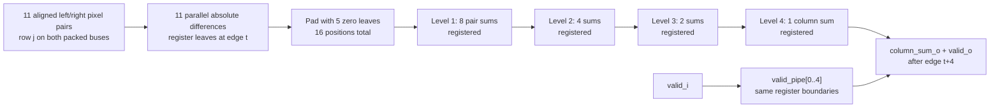

# Pipelined Column SAD Calculator
#implemented

[[Home]] · [[Single SAD Engine]] · [[Column Sum Buffer]] · [[Testbench Guide]]

Source: [rtl/column_sad.sv](rtl/column_sad.sv). Standalone bench: [tb_column_sad.sv](tests/rtl/tb_column_sad.sv).

## Complete source

```systemverilog
`timescale 1ns/1ps
`default_nettype none

// One disparity's vertical column cost. Row j occupies [j*PIXEL_W +: PIXEL_W].
// One abs-difference register stage, then ceil(log2(K)) registered add levels.
// Input sampled at edge t -> output valid after edge t+$clog2(K).
// No backpressure: bubbles move through the pipeline, not a global stall.
// rst_n is synchronous active-low; clear_i discards ALL in-flight columns.
module column_sad #(
    parameter integer K = 11,
    parameter integer PIXEL_W = 8,
    parameter integer COL_W = PIXEL_W + $clog2(K)
) (
    input  wire                       clk,
    input  wire                       rst_n,
    input  wire                       clear_i,
    input  wire                       valid_i,
    input  wire [K*PIXEL_W-1:0]       left_column_i,
    input  wire [K*PIXEL_W-1:0]       right_column_i,
    output wire                       valid_o,
    output wire [COL_W-1:0]           column_sum_o
);
    localparam integer LEVELS = $clog2(K);
    localparam integer LEAVES = 2**LEVELS;
    logic [LEVELS:0] valid_pipe;
    // Only active nodes in each level are driven/read; unused entries synthesize away.
    wire [COL_W-1:0] tree [0:LEVELS][0:LEAVES-1];

    always_ff @(posedge clk) begin
        if (!rst_n || clear_i) valid_pipe[0] <= 1'b0;
        else valid_pipe[0] <= valid_i;
    end

    // Separate declarations support the Quartus Prime Lite 22.1 parser.
    genvar j, level, node;
    generate
        for (j = 0; j < LEAVES; j = j + 1) begin : g_leaf
            if (j < K) begin : g_pixel
                wire [PIXEL_W-1:0] left_pixel = left_column_i[j*PIXEL_W +: PIXEL_W];
                wire [PIXEL_W-1:0] right_pixel = right_column_i[j*PIXEL_W +: PIXEL_W];
                wire [PIXEL_W-1:0] difference = (left_pixel >= right_pixel)
                    ? left_pixel - right_pixel : right_pixel - left_pixel;
                logic [COL_W-1:0] difference_reg;
                always_ff @(posedge clk) begin
                    if (!rst_n || clear_i) difference_reg <= '0;
                    else if (valid_i)
                        difference_reg <= {{(COL_W-PIXEL_W){1'b0}}, difference};
                end
                assign tree[0][j] = difference_reg;
            end else begin : g_padding
                assign tree[0][j] = '0;
            end
        end
        for (level = 1; level <= LEVELS; level = level + 1) begin : g_level
            always_ff @(posedge clk) begin
                if (!rst_n || clear_i) valid_pipe[level] <= 1'b0;
                else valid_pipe[level] <= valid_pipe[level-1];
            end
            for (node = 0; node < (LEAVES >> level); node = node + 1) begin : g_add
                logic [COL_W-1:0] sum_reg;
                always_ff @(posedge clk) begin
                    if (!rst_n || clear_i) sum_reg <= '0;
                    else if (valid_pipe[level-1])
                        sum_reg <= tree[level-1][2*node] + tree[level-1][2*node+1];
                end
                assign tree[level][node] = sum_reg;
            end
        end
    endgenerate

    assign valid_o = valid_pipe[LEVELS];
    assign column_sum_o = tree[LEVELS][0];

    // synthesis translate_off
    initial begin
        if (K < 1 || PIXEL_W < 1) $fatal(1, "K and PIXEL_W must be positive");
        if (COL_W < PIXEL_W + $clog2(K)) $fatal(1, "COL_W too small");
    end
    // synthesis translate_on
endmodule
`default_nettype wire
```

## Job of this module

For one supplied disparity alignment, accept K left pixels and K right pixels from a vertical column. Calculate the sum of their unsigned absolute differences. This is a **column** cost, not the complete K×K window cost. [[Column Sum Buffer]] provides horizontal reuse and the final window adder.

## Packed pixel convention

Row j occupies `[j*PIXEL_W +: PIXEL_W]` in both buses. Row zero is the least-significant slice. The producer must pair the correct corresponding left/right pixels. No image memory, rectification, disparity shifting, or coordinate generation lives here.

## Hardware stages

1. Compare each pixel pair and subtract smaller from larger. Register each absolute difference, zero-extended to COL_W.
2. Pad the conceptual leaf count to the next power of two with constant zeros. All real K pixels remain included.
3. At each tree level, add neighboring nodes and register the result. Padded constant branches may simplify during synthesis, but valid latency stays fixed.
4. Output the root and its associated validity bit.

For K=11 there are four registered reduction levels after the absolute-difference registers. This is **five register stages** from input sampling through column output. K=1 naturally bypasses reduction levels and uses only the registered absolute difference.

Full COL_W width is used throughout to make addition widths unambiguous; constant high bits can be optimized by synthesis.

## Precise latency convention

Let **t** be the rising edge that accepts an input. With L=ceil(log2(K)):
- Absolute differences are available just after edge t.
- Column output is available just after edge **t+L**.
- For K=11: column output after **t+4**.

“Five register stages” and “edge offset four” are not contradictory: the first register samples at t itself. No need to guess whether a count includes the sampling edge.

## Valid, bubbles, reset and clear

The pipeline advances every clock. Each valid bit follows its corresponding data. `valid_i=0` inserts a bubble; it does not freeze older in-flight work. Data registers only update when their incoming stage is valid, so output data holds during output-invalid cycles.

Synchronous active-low `rst_n` or active-high `clear_i` clears every pipeline validity bit and data register. Clear wins over simultaneous input validity. It is an **abort/flush**, not a delayed row marker: pending column results are discarded.

## Standalone verification

The testbench computes the expected column by a serial software-style sum, then schedules it at the documented output edge. It checks data and validity every cycle, including held data on bubbles and zero data on flush.

Directed tests cover zero differences, maximum differences in both subtraction directions, each pixel position independently, odd/non-power-of-two K, and flushes at different pipeline offsets. Deterministic random columns mix bubbles, resets and clears.

```sh
python scripts/run_tests.py --suite column
python scripts/run_tests.py --suite column --case 11:8 --vcd
```

See [[Timing and Pipelining]] for integration timing and [[Verification]] for actual run evidence. Quartus Lite 22.1 requires the separately declared `genvar` style used here; inline `for (genvar ...)` was rejected by the installed parser.

## Read the RTL alongside the reason for each line

The numbered ranges below refer to [rtl/column_sad.sv](rtl/column_sad.sv), whose complete, checked snapshot is at the top of this note. These explanations cover the behavior of the actual code—not a different implementation.

### Interface and widths (lines 1–22)

| Code | Why it is here |
|---|---|
| `` `timescale 1ns/1ps `` | Defines simulation time unit and precision; not the FPGA clock rate. |
| `` `default_nettype none `` | Makes a misspelled wire an error rather than an implicit net; the last line restores the default for other source files. |
| `parameter integer K = 11` | Compile-time number of vertical pixel pairs. Changing `K` elaborates different hardware; it is not a Nios V register. |
| `PIXEL_W = 8` | Each grayscale pixel is an unsigned 8-bit value by default. |
| `COL_W = PIXEL_W + $clog2(K)` | Enough bits for the *sum* of `K` pixel differences. With the defaults, the maximum is `11×255 = 2805`, which fits in 12 bits. |
| `clk`, `rst_n`, `clear_i`, `valid_i` | Rising-edge clock, synchronous active-low reset, synchronous abort/flush, and input acceptance indicator. There is no `ready` handshake. |
| `left_column_i`, `right_column_i` | Packed buses of `K` pixels each; pair row `j` from both buses before taking its absolute difference. |
| `valid_o`, `column_sum_o` | A valid bit and its associated *vertical column* cost—not an 11×11 window result. |

### Elaborated tree and leaf register (lines 23–53)

```systemverilog
localparam integer LEVELS = $clog2(K);
localparam integer LEAVES = 2**LEVELS;
logic [LEVELS:0] valid_pipe;
wire [COL_W-1:0] tree [0:LEVELS][0:LEAVES-1];
```

`LEVELS` is the number of *registered addition levels*; `LEAVES` pads the tree to a power of two. For `K=11`, they are 4 and 16. The tree is a network of signals and registers, **not** an 11-row memory. `valid_pipe[0]` belongs to the leaf register stage and the later entries belong to the add stages. Only the needed nodes of each later level are instantiated.

```systemverilog
if (!rst_n || clear_i) valid_pipe[0] <= 1'b0;
else valid_pipe[0] <= valid_i;
```

On an accepting edge, the first valid register records whether the leaf data is meaningful. Clearing also clears validity, so stale sums cannot be mistaken for new output. Every register assignment is nonblocking (`<=`): all stages sample the **old** preceding-stage values on an edge.

```systemverilog
wire [PIXEL_W-1:0] left_pixel = left_column_i[j*PIXEL_W +: PIXEL_W];
wire [PIXEL_W-1:0] right_pixel = right_column_i[j*PIXEL_W +: PIXEL_W];
wire [PIXEL_W-1:0] difference = (left_pixel >= right_pixel)
    ? left_pixel - right_pixel : right_pixel - left_pixel;
```

The generated `j` selects row `j` from both packed columns (`+:` means a fixed-width slice starting at that bit). Comparison chooses the nonnegative subtraction, so no signed interpretation or negative difference escapes this stage. The generate loop creates **K parallel comparators/subtractors**, not a loop that executes for K clock cycles.

```systemverilog
if (!rst_n || clear_i) difference_reg <= '0;
else if (valid_i)
    difference_reg <= {{(COL_W-PIXEL_W){1'b0}}, difference};
assign tree[0][j] = difference_reg;
```

At the same accepting edge, each absolute difference is registered and zero-extended to the column-sum width. The enable holds leaf data on a bubble; the valid bit says the held data is not a new column. For `j >= K`, the `g_padding` branch drives **constant zero** leaves; those do not consume incoming pixels. Parameter guards near the end reject widths that would make this extension invalid.

### Reduction and output (lines 54–81)

```systemverilog
else valid_pipe[level] <= valid_pipe[level-1];
...
else if (valid_pipe[level-1])
    sum_reg <= tree[level-1][2*node] + tree[level-1][2*node+1];
```

Each generated level pairs neighboring values from the *previous* registered level and registers their sum. There is one register boundary per level, which limits the combinational addition depth of any one stage. A bubble shifts through `valid_pipe` every clock, while each sum register holds its prior value when its input stage is invalid. Therefore a bubble does **not** stop a valid column behind or ahead of it.

```systemverilog
assign valid_o = valid_pipe[LEVELS];
assign column_sum_o = tree[LEVELS][0];
```

The final valid bit describes the root sum. Ignore `column_sum_o` when `valid_o=0`: it may simply be the held value from an earlier column. For `K=1`, `LEVELS=0`, so the leaf itself is the output and there are no reduction stages. The simulation-only `initial` checks verify legal positive parameters and sufficient `COL_W`; they do not add runtime hardware.

### Diagram: eleven pixel pairs become one column cost



The padding is an elaboration-time constant; the diagram does **not** mean the module spends a cycle loading zeros. For a particular row `j`, the mathematical leaf is `|left[j] − right[j]|`. The root is the sum of those eleven leaves.

### Diagram: edge timing and a bubble (`K=11`)

```text
Rising edge             t       t+1     t+2     t+3     t+4     t+5     t+6
Column A, accepted      abs     add1    add2    add3    add4    → engine buffer
Bubble at t+1                   —       —       —       —       invalid
Column B, accepted t+2                  abs     add1    add2    add3    add4
Calculator valid_o      0       0       0       0       A       0       B
```

Here `add4` at `t+4` is the calculator's registered output. The timeline assumes an empty pipeline before A; `A` and `B` in the final row mean `valid_o=1` for those respective columns. `→ engine buffer` is a **different module's** next-edge capture, not an extra register in this calculator. The bubble at `t+1` creates an invalid output after `t+5`; it does not pause A or B.
