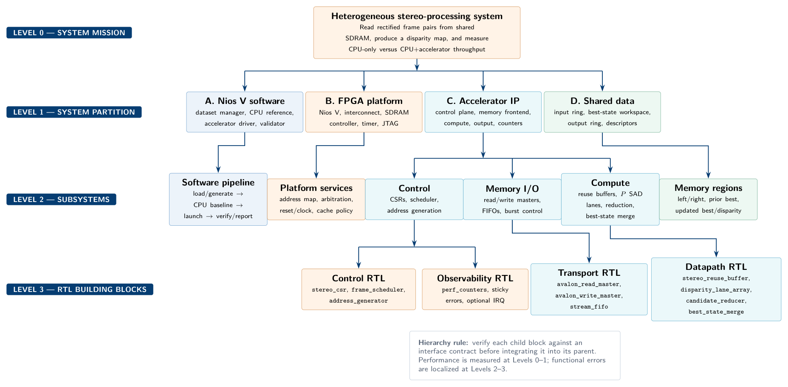

# Nios V Stereo Block-Matching Accelerator

A semester-project workspace for a scalable stereo block-matching accelerator on the **Terasic DE2-115 (Cyclone IV EP4CE115)**, integrated with a **Nios V soft-core CPU** and shared external SDRAM.

> **Current status:** Nios V `Hello World` runs successfully on the DE2-115. The next gate is a verified CPU/accelerator shared-SDRAM read-transform-write test.

## Primary report

- **[Download the PDF feasibility and architecture report](docs/stereo_block_matching_feasibility_report.pdf)**
- **[Download the top-down design hierarchy PDF](docs/design_hierarchy.pdf)** — block responsibilities, interfaces, implementation, verification, RTL tree, and build gates
- [Design hierarchy source](docs/design_hierarchy.md)
- [Markdown source](docs/stereo_block_matching_feasibility_report.md)
- [Curated videos, documentation, datasets, and reference projects](docs/resources.md)
- [Integration checklist](docs/integration_checklist.md)
- [Progress log](docs/progress.md)

## Proposed architecture



The CPU and accelerator access the same SDRAM. Internal line buffers and FIFOs are transient streaming-reuse structures—not a CPU-managed private frame store.

Additional LaTeX/TikZ diagrams:

- [System-level CPU/accelerator interconnect](docs/diagrams/system_architecture.pdf)
- [Accelerator subsystem hierarchy](docs/diagrams/accelerator_hierarchy.pdf)
- [Accelerator streaming datapath](docs/diagrams/accelerator_pipeline.pdf)
- [Parameterized SAD datapath](docs/diagrams/sad_datapath_hierarchy.pdf)
- [Proposed RTL module tree](docs/diagrams/rtl_module_tree.pdf)
- [End-to-end CPU/accelerator execution flow](docs/diagrams/execution_flow.pdf)
- [Editable TikZ sources](docs/diagrams/)

## Repository layout

```text
docs/       report, progress, architecture notes, and references
hardware/   Quartus/Platform Designer project and RTL
software/   Nios V BSP, driver, CPU baseline, and benchmark
 tools/      dataset preprocessing and report-generation scripts
 tests/      synthetic vectors, RTL testbenches, and expected outputs
```

## Recommended implementation order

1. Preserve the working Nios V Hello World project.
2. Verify external SDRAM with a destructive memory test.
3. Add an accelerator control slave and confirm register access.
4. Build an Avalon-MM copy/transform master and verify every output word.
5. Establish cache flush/invalidate or uncached-buffer behavior.
6. Implement and verify one SAD/disparity lane.
7. Complete full disparity search and winner-take-all selection.
8. Parameterize disparity lanes and collect resource/throughput curves.
9. Add continuous ping-pong processing and visual output.

## Data strategy

No stereo camera is required. Use:

1. Small custom shifted images for exact RTL tests.
2. Middlebury for primary accuracy evaluation.
3. A small Scene Flow sample for continuous synthetic sequences.
4. KITTI only as an optional realistic test.

## Visibility

The remote repository is created as **private by default** to avoid unintentionally publishing coursework. Visibility can be changed later through GitHub settings.
