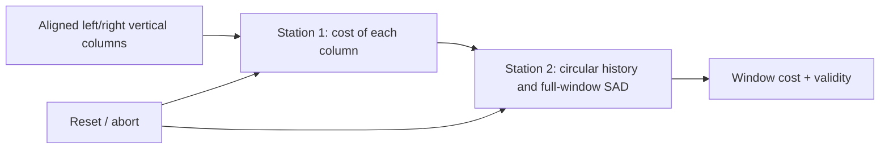
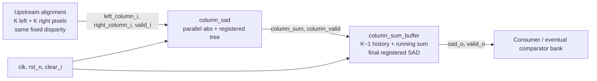

# Single SAD Engine
#implemented

[[Home]] · [[Pipelined Column SAD Calculator]] · [[Column Sum Buffer]] · [[Testbench Guide]] · [[Disparity Bank]]

Source: [rtl/sad_engine.sv](rtl/sad_engine.sv). Standalone bench: [tb_sad_engine.sv](tests/rtl/tb_sad_engine.sv).

## First, the story — no RTL yet

Picture a conveyor bringing **already paired** left/right vertical columns for one chosen disparity. The first station measures the difference at every row and combines those differences into one column cost. The second station keeps the costs of the preceding columns in a circular ledger. Once that ledger has enough history, it adds the new cost to the preceding costs to produce one complete square-window SAD. Each station stamps its output with “valid,” so a skipped input does not accidentally become a real window. The second station is one registered step behind the first. At the end of a scanline, let all submitted columns leave both stations before wiping their state for the next scanline.

The conveyor is **one fixed-disparity lane**. It does not fetch either image, choose the disparity, or decide which of 32 candidates wins. Its second station already includes the final window addition—there is no third arithmetic station in this wrapper.



**Map for reading code:** station 1 → `u_column_sad`; the handoff stamp and cost → `column_valid`/`column_sum`; station 2 → `u_column_sum_buffer`; the final product → `valid_o`/`sad_o`. The source and detailed mapping follow.

## Complete source

```systemverilog
`timescale 1ns/1ps
`default_nettype none

// One fixed-alignment disparity lane. Upstream supplies already-aligned K-pixel
// columns; image storage, disparity shifting and coordinate tags are NOT inside.
// Accepts one column per edge with valid_i; no input/output backpressure.
// Accepted input at edge t -> window output at t+$clog2(K)+1 (once K columns exist).
// clear_i flushes both the column pipeline and horizontal history immediately.
// Normal row end: drive valid_i=0 for $clog2(K)+1 edges, then clear on its own edge.
module sad_engine #(
    parameter integer K = 11,
    parameter integer PIXEL_W = 8,
    parameter integer COL_W = PIXEL_W + $clog2(K),
    parameter integer SAD_W = PIXEL_W + $clog2(K*K)
) (
    input  wire                       clk,
    input  wire                       rst_n,
    input  wire                       clear_i,
    input  wire                       valid_i,
    input  wire [K*PIXEL_W-1:0]       left_column_i,
    input  wire [K*PIXEL_W-1:0]       right_column_i,
    output wire                       valid_o,
    output wire [SAD_W-1:0]           sad_o
);
    wire column_valid;
    wire [COL_W-1:0] column_sum;

    column_sad #(.K(K), .PIXEL_W(PIXEL_W), .COL_W(COL_W)) u_column_sad (
        .clk(clk), .rst_n(rst_n), .clear_i(clear_i), .valid_i(valid_i),
        .left_column_i(left_column_i), .right_column_i(right_column_i),
        .valid_o(column_valid), .column_sum_o(column_sum)
    );

    // The existing buffer ALREADY includes the final H + new_column SAD adder.
    column_sum_buffer #(.K(K), .PIXEL_W(PIXEL_W), .COL_W(COL_W), .SAD_W(SAD_W))
    u_column_sum_buffer (
        .clk(clk), .rst_n(rst_n), .clear_i(clear_i),
        .valid_i(column_valid), .column_sum_i(column_sum),
        .valid_o(valid_o), .sad_o(sad_o)
    );
endmodule
`default_nettype wire
```

## Line-by-line mapping from conveyor story to RTL

These are line numbers in [rtl/sad_engine.sv](rtl/sad_engine.sv), not Markdown line numbers. The wrapper contains no hidden state besides its two instantiated modules.

| Source line(s) | What the statement does | Story / hardware mapping |
|---|---|---|
| 1–2 | Sets simulation precision and prevents implicit nets. | Catch wiring typos; neither directive adds a pipeline stage. |
| 4–9 | States fixed alignment, no backpressure, edge latency, clear, and row-end drain contract. | Defines what arrives at the conveyor and when to empty it. |
| 10–14 | Declares module and compile-time K/pixel/column/window widths. | Configures both stations for the *same* window dimensions. The final score needs room for all K×K differences. |
| 15–20 | Declares clock, reset, clear and the input-valid signal. | Both stations share one clock and one abort; `valid_i` marks a real incoming paired column. |
| 21–22 | Declares packed left/right vertical-column inputs. | The upstream aligner—not this wrapper—must deliver corresponding rows at one fixed disparity. |
| 23–24 | Declares final valid flag and complete-window score. | A customer reads `sad_o` only when `valid_o` is asserted. |
| 25 | Declares `column_valid`. | The stamp accompanying the *vertical-column cost* at the station handoff. |
| 26 | Declares `column_sum` at `COL_W` width. | The first station's score—not yet the square window score. |
| 28 | Instantiates `column_sad` with matching compile-time dimensions. | Physically builds the first station; it is not a function call executed on demand. |
| 29 | Wires clock/reset/clear/input-valid into station 1. | A column is accepted only when valid and is discarded on a clear. |
| 30 | Wires both aligned pixel buses. | Gives the difference desks corresponding left/right rows. |
| 31–32 | Wires station 1's valid and score outputs; closes instance. | Carries the stamped vertical cost toward station 2. |
| 34 | Documents that station 2 already performs the final addition. | Do **not** insert another `history + new` adder in this wrapper. |
| 35 | Instantiates `column_sum_buffer` at the same K and widths. | Physically builds the second station: circular horizontal history. |
| 36–37 | Wires shared clock/reset/clear into station 2. | Clearing both on one edge prevents an old-row column from repopulating a new-row tray. |
| 38 | Wires `column_valid` and `column_sum` to its inputs. | A bubble from the first station cannot advance the circular tray. |
| 39–40 | Wires the registered complete SAD and valid flag to the outer interface. | A result from station 2 is the wrapper's result; there is no third station. |
| 41–42 | Ends the module and restores normal nettype. | No extra output register is inserted here. |

**Trace an input:** the calculator registers its difference leaves when accepted at edge `t`; its root and `column_valid` appear after edge `t+$clog2(K)`. The second station sees those *new* registered wires at the next edge, `t+$clog2(K)+1`; only then can `sad_o` be valid if K−1 earlier column costs were accepted. Keep `valid_i=0` for `$clog2(K)+1` edges after a row's last input, and clear on a distinct subsequent edge so the final result is not aborted.

## Scope and connections

```text
Aligned K-pixel left/right columns
    → column_sad: abs differences + pipelined column reduction
    → column_sum_buffer: circular history + running total + final SAD adder
    → valid_o, sad_o
```

This is one **fixed-alignment disparity lane**, not the full disparity search. The frontend supplies correctly aligned vertical columns in horizontal sequence. No raw-image line buffer, disparity selection, coordinate tagging, backpressure, Nios V interface or memory master is implemented here.

The existing buffer already contains the final `history_sum + new_column` adder. Adding another arithmetic stage after `sad_o` would double-count rather than fill a missing function. The engine wrapper only connects the two proven modules.

## Ports and defaults

| Port | Contract |
|---|---|
| clk | Rising-edge clock |
| rst_n | Synchronous active-low reset of both components |
| clear_i | Immediate flush of both components; overrides valid_i |
| valid_i | Accept one aligned column pair |
| left_column_i, right_column_i | Packed K×PIXEL_W bits; row j in slice j*PIXEL_W +: PIXEL_W |
| valid_o | Complete K×K window SAD available |
| sad_o | Unsigned window SAD; held when invalid except reset/clear sets zero |

Defaults: K=11 and PIXEL_W=8. Column sums use 12 bits; window sums use 15 bits. Parameters are compile-time constants. The receiver must always consume valid outputs because no ready signal exists.

## Timing and warmup

Let L=ceil(log2(K)). A column accepted at rising edge t reaches:
1. The calculator output just after **t+L**.
2. The buffer output just after **t+L+1**, if it completes a window.

The buffer samples the previous calculator output on an edge; it cannot see that edge's new nonblocking register value until the next edge.

For K=11, accepted input at edge t produces its completed-window result after **t+5**, once ten prior accepted columns exist. This is six register stages including the absolute-difference sampling stage. Thereafter, consecutive valid inputs can produce consecutive outputs, subject to actual fitted timing.

With first accepted input at edge 0 and no gaps: eleventh column is accepted at edge 10, its column sum appears after edge 14, and the first full window appears after edge 15. Warmup counts accepted columns; pipeline travel counts clock edges.

## Row boundary protocol: drain, clear, restart

Normal completion (preserve all pending results):
1. Accept the final input column at edge t.
2. Drive valid_i=0 for **L+1 rising edges**. During this drain, still consume any valid outputs.
3. Assert clear_i on the following separate rising edge (valid_i=0).
4. Deassert clear_i and start the next row on the next edge.

For K=11, drain five rising edges before the clear edge. Do **not** clear on the final-result edge: clear has priority and would discard it.

Abort (discard pending work): assert clear_i immediately. All pipeline entries and horizontal history are invalidated; the next row can begin on the following edge and warms up normally.

No metadata-driven overlap between rows is implemented. A future high-throughput frontend may carry row-boundary markers, but that requires a separately verified protocol.

## Independent engine test

The scoreboard stores raw left and right pixels for the latest K accepted columns and recomputes **all K×K absolute differences** for every eligible window. It does not read the DUT's column sum, buffer history, pointer, or running total. Only the final expected result is delayed to its specified output edge.

Tests include identical/maximal/nonuniform rows, exact per-row output counts after draining, short rows, warmup, bursts/bubbles, early aborts, resets, simultaneous clear/valid and random traffic.

```sh
python scripts/run_tests.py --suite engine
python scripts/run_tests.py --suite engine --case 11:8 --seed 12345 --random-cycles 5000 --vcd
```

Open **Stereo_SAD_Engine.qpf** for component synthesis. The original **Stereo_SAD.qpf** remains the buffer-only project. See [[Hardware Integration]] for synthesis results and limitations.

## Code walkthrough: how the wrapper makes a complete window

This section explains the exact [rtl/sad_engine.sv](rtl/sad_engine.sv) snapshot above. It is intentionally one wrapper: **no extra adder or comparator is hiding between the two instances**.

### Header, parameters and ports (lines 1–24)

| Code | Why it is here |
|---|---|
| `` `timescale 1ns/1ps `` and `` `default_nettype none `` | Set simulation precision and reject accidental implicit nets; restore default net type after the module. Neither is a pipeline stage. |
| `K=11`, `PIXEL_W=8` | Compile-time kernel side and pixel width; all connections agree on them. These are not runtime Nios V settings. |
| `COL_W = PIXEL_W + $clog2(K)` | Vertical cost width. For the defaults, the largest column cost is 2805, needing 12 bits. |
| `SAD_W = PIXEL_W + $clog2(K*K)` | Complete window cost width. With 11×11 8-bit pixels, the largest possible SAD is 30855, needing 15 bits. |
| `valid_i` plus packed columns | One already-aligned pair of vertical K-pixel columns is offered per asserted input edge. The engine does not fetch image pixels. |
| `valid_o` and `sad_o` | The full K×K window result and its validity; the consumer must ignore `sad_o` when invalid. |

### First connection: column calculator (lines 25–32)

```systemverilog
wire column_valid;
wire [COL_W-1:0] column_sum;
column_sad #(.K(K), .PIXEL_W(PIXEL_W), .COL_W(COL_W)) u_column_sad (
    .clk(clk), .rst_n(rst_n), .clear_i(clear_i), .valid_i(valid_i),
    .left_column_i(left_column_i), .right_column_i(right_column_i),
    .valid_o(column_valid), .column_sum_o(column_sum)
);
```

`column_valid` and `column_sum` are **internal wires**, not two extra registers. Named port connections keep data, validity, clock, reset, and clear paired. `column_sad` takes K parallel absolute differences, then reduces them through its registered tree. In particular `column_valid` becomes true after edge `t+$clog2(K)` for input accepted at `t`; see [[Pipelined Column SAD Calculator]].

### Second connection: circular column history (lines 34–42)

```systemverilog
column_sum_buffer #(.K(K), .PIXEL_W(PIXEL_W), .COL_W(COL_W), .SAD_W(SAD_W))
u_column_sum_buffer (
    .clk(clk), .rst_n(rst_n), .clear_i(clear_i),
    .valid_i(column_valid), .column_sum_i(column_sum),
    .valid_o(valid_o), .sad_o(sad_o)
);
```

The buffer accepts `column_sum` **only when** `column_valid=1`. It keeps a circular history of the preceding K−1 accepted column sums. When full, it registers `history_sum + new_column` as `sad_o`; in that same edge, it evicts the oldest history entry and updates the history for the *next* input. Thus the buffer already implements the proposed final adder. No duplicate window addition belongs in this wrapper. A bubble in the calculator does not write the history.

The synchronous `rst_n` and `clear_i` go to **both** instances so a clear flushes in-flight calculator data and the buffer's previous-row history on the same edge. There is no `ready_o`, clock-domain crossing, multi-lane comparator, or disparity index here.

### Diagram: one fixed-disparity lane



The upstream alignment and eventual comparator are **not part of this engine**. For 32 disparities, 32 such lanes and a comparator with aligned tags would be a later integration milestone, not something this diagram claims is built.

### Diagram: why the extra cycle matters (`K=11`)

```text
Edge                t        t+1      t+2      t+3      t+4      t+5
Accepted column C   abs      add1     add2     add3     add4     buffer
column_valid        0        0        0        0        C        next
engine valid_o      0        0        0        0        0        C if warm
```

This timeline assumes the pipeline was empty before C. `C` in a valid row means the signal is asserted **for C**, not that the valid wire stores a pixel value. At `t+4`, the buffer still sees the *previous* calculator registers because both modules clock on the same edge. At `t+5`, the buffer sees C's valid sum and produces a window result if it already had K−1 accepted sums. Bubbles change the number of **accepted** columns in history, not this edge-to-edge pipeline delay.

### Diagram: warmup and row end

```text
Accepted columns in one row:  C0 C1 ... C9 C10 C11 ...
Buffer before C10:           [C0 C1 ... C9]  (10 retained)
At C10's buffer edge:        sad = C0 + ... + C10; then evict C0
At C11's buffer edge:        sad = C1 + ... + C11; then evict C1
Final raw input edge t:      valid_i=1
Next 5 edges (K=11):        valid_i=0; allow last sum to leave buffer
Following separate edge:    clear_i=1; invalidate both modules
Next edge:                  begin the next row
```

`C0` through `C11` here denote **computed vertical costs**, not image pixels. If the row had fewer than K accepted columns, no complete horizontal window is valid. The `clear_i` edge is separate from the drain because clear has priority and would suppress a result due on that edge.