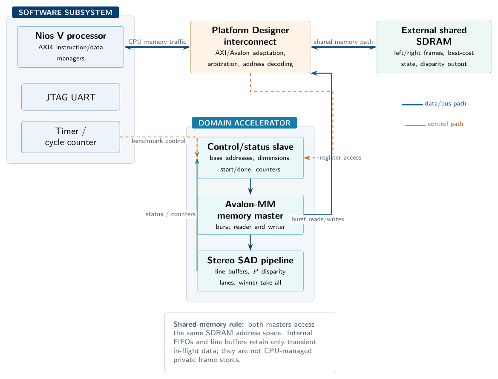
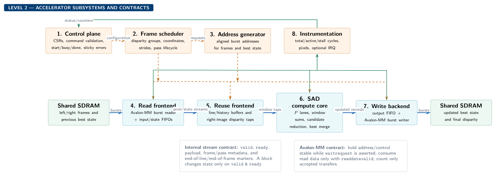
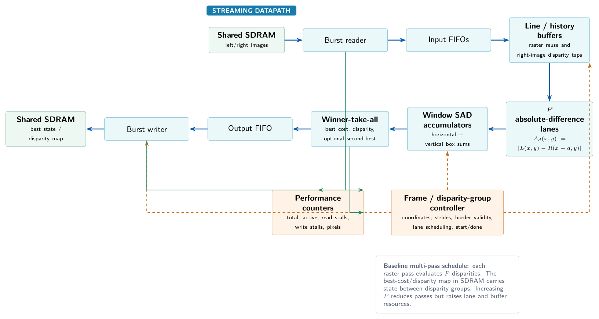
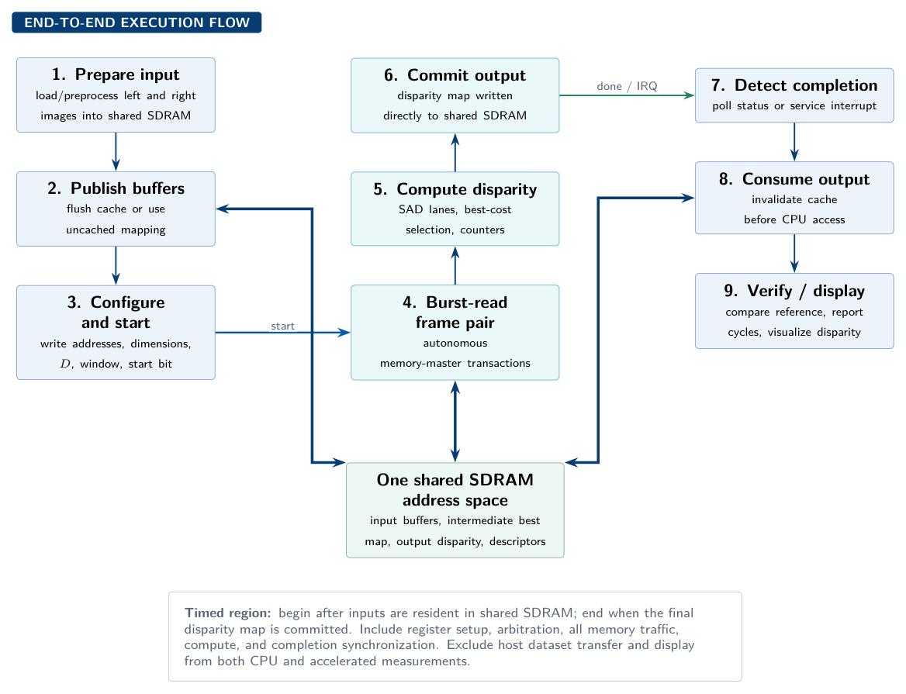

# Scalable Shared-Memory Stereo Block-Matching Accelerator on a Nios V FPGA System

## Architecture, integration plan, feasibility assessment, dataset strategy, and current progress

**Target platform:** Terasic DE2-115, Cyclone IV EP4CE115  
**Team:** Three members  
**Available development period:** Approximately six weeks  
**Input source:** Stored or simulated rectified stereo pairs; no live stereo camera required  

---

## 1. Executive summary

This project proposes a parameterizable stereo block-matching accelerator integrated with a Nios V soft-core processor. The Nios V software and accelerator access the same external SDRAM through the Platform Designer memory interconnect. The CPU manages datasets, configures the accelerator, performs optional post-processing, measures execution time, and controls the demonstration. The accelerator reads left and right images directly from shared SDRAM, calculates Sum of Absolute Differences (SAD) costs for multiple disparity candidates, selects the best disparity for each valid pixel, and writes the disparity map back to shared SDRAM.

The project is technically feasible within the available period if the scope is controlled:

- Use pre-rectified, grayscale stereo pairs.
- Begin with a modest resolution, matching window, and disparity range.
- Use integer SAD rather than normalized correlation or learned stereo.
- Parameterize the number of parallel disparity lanes.
- Treat confidence filtering, left-right consistency, VGA polish, and live cameras as optional extensions.
- Verify external SDRAM and custom-master operation before optimizing the stereo pipeline.

The absence of a stereo camera is not a significant limitation. In fact, stored datasets are better for repeatable CPU-versus-accelerator benchmarking and numerical correctness checking. The recommended data strategy is:

1. Custom synthetic shifted images for exact stage-level verification.
2. Middlebury stereo pairs and ground-truth disparity for primary evaluation.
3. A small Scene Flow sample for a continuous synthetic sequence.
4. KITTI only as an optional realistic road-scene test.

The current successful Nios V “Hello World” execution is an important milestone. It confirms that the team can generate, program, boot, and communicate with a Nios V system on the DE2-115. The next critical milestone is not more stereo RTL; it is proving shared SDRAM access and a custom accelerator master performing a verified read-transform-write transaction.

**Feasibility verdict:** Feasible with medium implementation risk and a high probability of producing a polished result, provided shared-memory integration is proven early and the first implementation remains integer-only and fixed-function.

---

## 2. Current progress update

### 2.1 Completed

- The team has successfully instantiated and run Nios V on the DE2-115.
- The FPGA has been programmed successfully.
- A Nios V “Hello World” application has executed successfully.
- The processor clock, reset path, instruction execution, software build flow, download/debug path, and JTAG UART communication are therefore operational at a basic level.
- Nios V compatibility with the team's actual board and tool configuration has been demonstrated experimentally; this is stronger evidence than relying only on a device-support table.

### 2.2 What this milestone proves

The successful application de-risks:

- Basic Nios V hardware generation.
- FPGA programming.
- BSP/application generation.
- Nios V software compilation.
- JTAG debugging and terminal output.
- Basic Platform Designer interconnection to the memory used by the Hello World system.

### 2.3 What remains unproven

The following must still be verified explicitly:

- Reliable Nios access to the board's external SDRAM.
- Correct SDRAM clocking, pin assignment, timing, and memory test operation.
- A custom accelerator acting as a memory master.
- Arbitration when Nios V and the accelerator access SDRAM.
- CPU cache flush/invalidate or uncached-buffer behavior.
- Burst transfers and sustained SDRAM bandwidth.
- Hardware cycle counting.
- Loading left/right images into shared SDRAM.
- Correct accelerator output written back into shared SDRAM.

### 2.4 Immediate next milestone

Build a minimal memory-processing accelerator before implementing stereo:

1. CPU writes a known word array into external SDRAM.
2. CPU flushes the relevant cache or uses an uncached region.
3. Accelerator reads the array through its memory-master interface.
4. Accelerator performs a trivial transformation such as copying, incrementing, or XORing each word.
5. Accelerator writes the output into another SDRAM region.
6. CPU invalidates its output cache region if necessary.
7. CPU compares every result against a software reference and prints PASS/FAIL.

This test should include enough data to exercise multiple bursts and address boundaries. It becomes the reusable memory shell for the stereo accelerator.

---

## 3. Project objective and research question

### 3.1 Objective

Design, integrate, and evaluate a scalable stereo block-matching accelerator operating as part of a Nios V heterogeneous system, with left images, right images, intermediate best-cost data where required, and output disparity maps stored in shared external SDRAM.

### 3.2 Main research question

> How do disparity-lane parallelism, on-chip streaming reuse, and shared-SDRAM traffic affect the resource cost, sustained throughput, and end-to-end speedup of stereo block matching relative to a Nios V software implementation?

### 3.3 Required evidence

The final project should provide:

- A CPU-only integer SAD implementation.
- A CPU-plus-accelerator implementation of the same algorithm.
- End-to-end cycle measurements.
- Sustained processing of a sequence or repeated collection of stereo pairs.
- At least two synthesized parallelism configurations, preferably more if timing permits.
- Logic, register, embedded-memory, and multiplier/DSP resource reports.
- Maximum clock frequency and timing-closure results.
- Throughput and speedup curves.
- Numerical comparison against a software golden model and available ground truth.
- A visual disparity/depth demonstration.

---

## 4. Stereo block-matching algorithm

### 4.1 Assumptions

The input images must be rectified. Rectification makes corresponding points lie on approximately the same image row, reducing correspondence search to the horizontal direction.

The minimum implementation uses:

- Eight-bit grayscale images.
- Non-negative integer disparities.
- A fixed odd-sized support window.
- Sum of Absolute Differences.
- Winner-take-all disparity selection.
- Integer arithmetic only.

### 4.2 Matching cost

For left-image pixel `(x, y)` and disparity candidate `d`, the right-image candidate is `(x-d, y)`.

The SAD cost is:

\[
C(x,y,d)=
\sum_{j=-r}^{r}
\sum_{i=-r}^{r}
\left|
I_L(x+i,y+j)-I_R(x-d+i,y+j)
\right|
\]

The window dimension is:

\[
K=2r+1
\]

The output disparity is:

\[
d^*(x,y)=\arg\min_{d\in[0,D-1]} C(x,y,d)
\]

A deterministic tie rule must be specified. The recommended policy is to select the smallest disparity among equal minimum costs.

### 4.3 Valid output region

Pixels are invalid where:

- The support window extends outside the image.
- The right candidate coordinate becomes negative.
- The disparity search extends beyond available right-image pixels.

The CPU and accelerator must implement exactly the same border policy. The simplest policy is to write disparity zero and clear a validity bit for invalid output pixels.

### 4.4 Optional confidence

The accelerator may retain the smallest and second-smallest costs. A simple uniqueness/confidence measure is:

\[
U=C_{second}-C_{best}
\]

Low values indicate ambiguous matches. This is useful in textureless or repeated-pattern regions, but should be an extension after the basic disparity map is correct.

### 4.5 Depth conversion

If camera calibration is available, approximate depth is:

\[
Z=\frac{fB}{d}
\]

For dataset-only evaluation, the accelerator does not need to calculate depth. It should output disparity. The CPU can calculate depth for selected display points or simply visualize disparity. Avoid placing division in the critical FPGA pipeline.

---

## 5. Recommended system architecture

The design is organized top-down so that system requirements, subsystem responsibilities, RTL modules, and implementation tasks are not mixed at the same level.


### 5.1 Abstraction levels

| Level | Design question | Main evidence |
|---|---|---|
| 0 — System mission | What must the complete CPU+accelerator system demonstrate? | Correct disparity, continuous throughput, CPU speedup, scaling curve |
| 1 — System partition | Which CPU, platform, accelerator, and shared-data blocks cooperate? | Platform Designer interconnect and software/hardware boundary |
| 2 — Subsystems | Which control, memory, compute, and instrumentation services are required? | Interface contracts and subsystem tests |
| 3/4 — RTL | What cycle-level datapath and independently testable modules implement them? | Unit tests, assertions, and generated parameter builds |

The complete responsibility/interface/implementation/verification breakdown is maintained in `docs/design_hierarchy.md`.

### 5.2 System-level interconnect



Nios V processors commonly expose AXI4 instruction/data manager interfaces, while many Platform Designer peripherals use Avalon Memory-Mapped interfaces. Platform Designer can generate the required interconnect and adaptation. The exact generated interface should be confirmed from the instantiated Nios V variant rather than assuming that the CPU itself exposes a native Avalon-MM master.

The hard shared-memory requirement is still met: both the CPU path and accelerator master reach the same external SDRAM controller through the generated memory interconnect.

### 5.3 Recommended components

- Nios V processor already proven by the team.
- JTAG UART for debug and benchmark output.
- On-chip memory for boot code or small program sections if required.
- External SDRAM controller.
- Timer or Nios cycle counter for CPU timing.
- Custom stereo accelerator.
- Optional accelerator interrupt.
- Optional VGA pixel-buffer/display subsystem.

### 5.4 Accelerator interfaces

The accelerator should expose:

1. **Control/status slave:** CPU-visible configuration registers.
2. **Memory master:** direct reads and writes to shared SDRAM.
3. **Clock and reset.**
4. **Optional interrupt:** asserted on frame or batch completion.

### 5.5 Illustrative control-register map

The exact offsets are implementation-defined, but a practical map is:

| Register | Purpose |
|---|---|
| `CONTROL` | Start, reset, interrupt enable |
| `STATUS` | Busy, done, error, overflow |
| `LEFT_BASE` | Left-image SDRAM address |
| `RIGHT_BASE` | Right-image SDRAM address |
| `OUTPUT_BASE` | Output disparity address |
| `BEST_COST_BASE` | Intermediate best-cost address if used |
| `WIDTH` | Image width |
| `HEIGHT` | Image height |
| `LEFT_STRIDE` | Left-image row stride |
| `RIGHT_STRIDE` | Right-image row stride |
| `OUTPUT_STRIDE` | Output row stride |
| `MAX_DISPARITY` | Number of candidates |
| `WINDOW_CONFIG` | Window size/configuration |
| `FRAME_COUNT` | Number of pairs in a batch/ring |
| `TOTAL_CYCLES` | End-to-end accelerator cycles |
| `READ_STALLS` | Cycles stalled on memory reads |
| `WRITE_STALLS` | Cycles stalled on writes |
| `ACTIVE_CYCLES` | Datapath-active cycles |
| `OUTPUT_PIXELS` | Valid pixels completed |
| `ERROR_FLAGS` | Alignment, bounds, FIFO, or bus errors |

Registers should be accessed through volatile memory-mapped pointers in C. Use appropriate memory barriers around start/status operations.

---

## 6. Accelerator microarchitecture

### 6.1 Subsystem decomposition



The control plane accepts one stable configuration snapshot. The scheduler and address generator turn it into frame/pass transactions. Read and write frontends isolate Avalon-MM timing from the streaming compute pipeline using `valid/ready` FIFOs. Instrumentation observes accepted transfers and stalls without becoming part of the functional data path.

| Block | Contribution | First proof |
|---|---|---|
| Control plane | Stable CPU-visible configuration and command/status semantics | ID, scratch, start/busy/done register test |
| Scheduler/address generator | Deterministic frame, row, and disparity-group transactions | Tiny dimensions, boundary addresses, and injected stalls |
| Read frontend | Converts accepted SDRAM reads into ordered elastic streams | Pass-through transform with randomized wait states |
| Reuse frontend | Produces aligned window and disparity taps from raster pixels | Ramp/impulse images and border-validity checks |
| SAD compute core | Produces and merges parameterized disparity candidates | Bit-exact tiny-frame comparison for `P_LANES=1` |
| Write backend | Commits updated state/output before asserting completion | Random write stalls and final-burst test |
| Instrumentation | Explains active, memory-stalled, and total execution time | Counter-event and reset/snapshot tests |

<div class="page-break"></div>

### 6.2 High-level streaming pipeline



### 6.3 Why line buffers are necessary

Neighbouring output windows overlap heavily. Reading the complete left and right window from SDRAM for every pixel and disparity would waste bandwidth. The accelerator should burst-read raster-ordered pixels and hold only the rows/history required for the active window.

These line buffers are transient streaming reuse structures. They do not constitute a CPU-managed private copy-in/copy-out memory because:

- Official input images remain in shared SDRAM.
- The accelerator fetches them itself.
- The complete output remains in shared SDRAM.
- The CPU does not copy frames into a separate accelerator address space.

The interpretation should nevertheless be stated explicitly in the proposal and confirmed with the lecturer.

### 6.4 Cost-volume formulation

A hardware-friendly formulation separates per-pixel absolute difference from box-window accumulation.

For every disparity:

\[
A_d(x,y)=|I_L(x,y)-I_R(x-d,y)|
\]

Then:

\[
C(x,y,d)=\sum_{i,j}A_d(x+i,y+j)
\]

Each disparity lane contains:

- A right-pixel disparity tap.
- Absolute-difference logic.
- Horizontal window accumulation.
- Vertical/window accumulation using line storage.
- Cost output.


### 6.5 Parameterized disparity lanes

Define:

```text
DISPARITY_LANES = P
MAX_DISPARITY   = D
```

The accelerator evaluates `P` candidates concurrently. This produces a direct resource-versus-throughput trade-off.

Two implementation schedules are possible.

#### Architecture A: disparity-group raster passes — recommended first implementation

For each group of `P` disparities:

1. Raster-scan the stereo pair.
2. Calculate SAD costs for the group.
3. Read the previous best cost/disparity for each pixel from shared SDRAM.
4. Update the best result where a lower cost is found.
5. Write updated best cost/disparity back to shared SDRAM.
6. Continue with the next disparity group.

Advantages:

- Simple control.
- Natural lane parameterization.
- Easy stage-level verification.
- A smaller right-pixel tap range per pass.
- Shared-SDRAM behavior is explicit and measurable.

Disadvantages:

- Frames are read multiple times when `P < D`.
- Intermediate best maps create extra SDRAM traffic.
- Performance may become memory-bound at high lane counts.

This memory bottleneck is acceptable as a systems-performance result, provided it is measured honestly.

#### Architecture B: pixel-stationary full disparity search — optimization

For each output pixel, retain the required window/history while all disparity groups are evaluated, then write only the final disparity.

Advantages:

- Less external image and intermediate-map traffic.
- Better theoretical bandwidth efficiency.

Disadvantages:

- More complicated scheduling and buffering.
- Larger right-image history requirements.
- Harder to maintain a streaming initiation rate.
- Higher implementation risk.

Architecture A is recommended for the guaranteed project. Architecture B is a stretch optimization if the baseline reaches completion early.

### 6.6 Winner-take-all unit

For every pixel, maintain:

```text
best_cost
best_disparity
optional_second_best_cost
```

For candidate disparity `d`:

```text
if candidate_cost < best_cost:
    second_best = best_cost
    best_cost = candidate_cost
    best_disparity = d
else if candidate_cost < second_best:
    second_best = candidate_cost
```

The comparison ordering and equality behavior must exactly match the CPU reference.

### 6.7 Arithmetic widths

The pixel absolute difference fits within the unsigned pixel range. SAD accumulation requires a wider type because multiple differences are summed. Width should be derived from:

- Pixel width.
- Window area.
- Maximum possible pixel difference.

Use explicit widths and saturation/overflow assertions in simulation. Do not depend on implicit Verilog expression sizing.

### 6.8 Backpressure

Every stage must support valid/ready behavior or an equivalent controlled stall. The system must remain correct when:

- SDRAM read responses are delayed.
- The output FIFO becomes full.
- The write master is stalled.
- A row or frame boundary occurs during a stall.

Pixel coordinates and disparity-group state must advance only when the corresponding data transfer is accepted.

---

## 7. Shared-SDRAM memory map and streaming

### 7.1 Suggested regions

```text
LEFT_BUFFER_0
RIGHT_BUFFER_0
OUTPUT_BUFFER_0
LEFT_BUFFER_1
RIGHT_BUFFER_1
OUTPUT_BUFFER_1
BEST_COST_BUFFER
BEST_DISPARITY_BUFFER
DESCRIPTOR_RING
TRACKING/PERFORMANCE METADATA
```

Use aligned base addresses and row strides compatible with the memory-master data width and burst policy.

### 7.2 Ping-pong operation

For continuous processing:

- CPU or loader fills buffer set A.
- Accelerator processes buffer set B.
- Display or CPU consumes the completed output from the previous set.
- Roles rotate after completion.

A descriptor can contain:

```c
struct StereoDescriptor {
    uint32_t left_base;
    uint32_t right_base;
    uint32_t output_base;
    uint32_t width;
    uint32_t height;
    uint32_t frame_id;
    uint32_t status;
};
```

The accelerator may initially process one descriptor per start command. Descriptor-ring operation can be added after the single-frame path is stable.

### 7.3 Cache coherency

Do not assume hardware cache coherence.

Before the accelerator reads a CPU-written image:

- Flush the corresponding CPU data-cache lines, or
- Place buffers in an uncached region/use uncached accesses.

Before the CPU reads accelerator-written disparity:

- Invalidate the corresponding CPU cache lines, or
- Read through an uncached mapping.

A stale-cache failure can look like an accelerator arithmetic bug. Cache behavior should be tested using the initial copy/transform accelerator.

### 7.4 Fair timing boundary

Dataset transfer from a PC into the board may be excluded from the benchmark if it is identical preprocessing/input setup for both versions. The timed region should begin when the stereo pair is already available in shared SDRAM and end when the disparity map is valid in shared SDRAM.

The accelerated time must include:

- Register setup.
- Accelerator start.
- Shared-memory reads.
- All matching computation.
- Intermediate shared-memory traffic.
- Output writes.
- Completion synchronization.

Do not report only SAD-pipeline cycles as end-to-end speedup.

---

## 8. Nios V integration

### 8.1 Significance of the completed Hello World test

The team has already passed the first Nios V integration gate. The official Nios V quick-start flow describes a simple system consisting of a Nios V processor, JTAG UART, and memory, generated through Platform Designer. The team has demonstrated an equivalent basic development path on its actual DE2-115 configuration.

### 8.2 Recommended Platform Designer development sequence

1. Preserve the currently working Hello World project as a known-good baseline.
2. Place it under version control or archive a complete copy.
3. Add and validate external SDRAM without the stereo accelerator.
4. Run destructive SDRAM tests over the intended image-buffer region.
5. Add the accelerator control slave only and verify register reads/writes.
6. Add the accelerator memory master with a copy/transform datapath.
7. Verify concurrent CPU and accelerator access.
8. Replace the transform datapath with one-pixel absolute difference.
9. Add threshold-free SAD for a tiny test case.
10. Add the window, disparity search, and final output incrementally.


Never modify the only working Nios project without keeping a recoverable baseline.

### 8.3 CPU software structure



### 8.4 Cycle timing

Possible CPU timing mechanisms include:

- Reading the RISC-V cycle counter where supported by the configured core and software environment.
- A Platform Designer timestamp/performance timer.
- A custom free-running memory-mapped counter.

Use one stable mechanism consistently. The accelerator should also count its own total and stall cycles. If CPU and accelerator counters use different clock domains, report clock frequency and convert carefully.

For the CPU-only benchmark:

- Use the same integer algorithm.
- Use the same input and output buffers in SDRAM.
- Use the same border and tie policies.
- Avoid compiler optimizing away output production.
- Repeat enough frames to amortize one-time setup.

### 8.5 Polling versus interrupts

Polling is acceptable for the first complete implementation and may give simpler timing. An interrupt can be added for the continuous demonstration, but it is not necessary to prove acceleration.

---

## 9. Dataset and simulator strategy without a stereo camera

### 9.1 Recommendation

Use three data levels:

#### Level 1: custom synthetic verification pairs

Generate a textured grayscale left image and create the right image by shifting selected regions horizontally by known disparities. Include:

- One constant-disparity region.
- Two regions at different disparities.
- A slanted or stepped disparity map.
- Occlusion boundaries.
- Repeated textures.
- Textureless regions.

This provides exact expected disparities and very small images for RTL simulation.

#### Level 2: Middlebury

Middlebury provides established stereo datasets and ground-truth disparity maps. Its dataset page includes multiple generations of stereo scenes, including structured-light ground truth. It is suitable for primary accuracy evaluation and report figures.

Recommended use:

- Select a small number of representative pairs.
- Convert to grayscale offline.
- Crop or downsample to a board-friendly resolution.
- Scale or constrain disparity values consistently.
- Preserve a valid-pixel mask.
- Export raw left, right, and ground-truth files.

#### Level 3: Scene Flow sample

Scene Flow provides synthetic stereo sequences with left/right images, disparity, optical flow, and camera information. The official page reports more than 39,000 rendered stereo frames and also provides a smaller sample pack. Use only a small subset; the complete collection is unnecessary.

Scene Flow is useful for demonstrating continuous processing because it contains sequential synthetic frames and exact disparity.

#### Optional: KITTI

KITTI provides realistic road-driving stereo scenes. Its stereo benchmarks include static and moving-object scenes. It is visually compelling but has larger images, difficult lighting, and incomplete/sparse ground truth in some configurations. Use it as a stretch demonstration rather than the first verification source.

### 9.2 Simulator choices

A custom Python generator is the fastest route for exact verification. A 3D simulator such as Blender can generate more realistic stereo pairs, but camera placement, rendering, and ground-truth extraction add work. Because strong public stereo datasets already exist, building a sophisticated simulator is unnecessary.

Recommended order:

1. Python shifted-region generator.
2. Middlebury dataset.
3. Scene Flow sample sequence.
4. Blender or another simulator only if a custom moving scene is desired after the accelerator works.

### 9.3 Offline preprocessing

Create a preprocessing script that:

- Reads source images.
- Confirms left/right dimensions match.
- Converts RGB to grayscale.
- Optionally crops/downsamples.
- Converts ground-truth disparity into the chosen integer format.
- Writes tightly packed raw binary files.
- Writes metadata: width, height, stride, valid region, disparity scale.
- Generates C headers only for very small unit-test images.

Preprocessing must be identical for CPU-only and accelerated tests.

### 9.4 Loading data onto the FPGA

Possible methods include:

- Nios software containing a few small test images as constant arrays and placing them into shared SDRAM during setup.
- JTAG/debugger loading of raw data into SDRAM.
- UART transfer from a host utility.
- Board-supported removable storage if the existing platform provides a reliable driver.

Input loading is not part of the timed stereo kernel unless the module explicitly requires it. For the demonstration, load several pairs before timing and process them repeatedly or through ping-pong buffers.

---

## 10. Verification plan

### 10.1 Software golden model

Create one canonical integer implementation on the development PC first. Port the same code to Nios V with minimal semantic changes.

The model must define:

- Pixel format.
- Window size.
- Disparity range.
- Border behavior.
- Accumulator width.
- Overflow policy.
- Tie-breaking rule.
- Output format.

### 10.2 RTL unit tests

Test independently:

- Absolute difference.
- Right-pixel disparity selection.
- Horizontal sum.
- Vertical/window sum.
- SAD accumulator width.
- Minimum-cost selector.
- Equal-cost tie handling.
- Row and frame boundaries.
- FIFO stalls.
- Avalon wait states.
- Non-burst-aligned final row or frame.
- Invalid image dimensions and addresses.

### 10.3 Tiny end-to-end tests

Use very small synthetic images where every SAD cost can be inspected. Compare:

- Every disparity cost for selected pixels.
- Every best cost.
- Every selected disparity.
- Validity-mask output.

### 10.4 FPGA comparison

For every hardware configuration:

1. CPU writes input into SDRAM.
2. CPU runs the integer reference and stores a reference map.
3. Accelerator runs from the same input buffers.
4. CPU compares maps pixel by pixel.
5. Any mismatch prints coordinates, expected value, actual value, and optionally best cost.

### 10.5 Accuracy metrics

Report separately:

- FPGA versus integer software exact-match percentage.
- Mean absolute disparity error against dataset ground truth.
- Bad-pixel rate using a stated threshold.
- Valid-pixel coverage.
- Error near occlusions/boundaries.
- Confidence/uniqueness behavior if implemented.

The FPGA should ideally match the integer software exactly. Accuracy against scene ground truth evaluates the block-matching algorithm itself, not merely the RTL.

---

## 11. Performance and scalability evaluation

### 11.1 Primary parameter

Use:

```text
DISPARITY_LANES
```

Synthesize multiple values that fit timing and resources.

### 11.2 Reported implementation metrics

For each configuration:

- Logic elements.
- Registers.
- Embedded-memory bits/blocks.
- DSP/multiplier use.
- Maximum clock frequency.
- Total cycles per frame.
- Valid output pixels per second.
- Frames per second.
- Read-stall cycles.
- Write-stall cycles.
- Datapath-active cycles.
- End-to-end speedup over Nios V.

### 11.3 Expected trend

Increasing disparity lanes should initially improve throughput. Scaling will eventually flatten because of:

- External SDRAM bandwidth.
- Intermediate best-map traffic in the multi-pass architecture.
- Line-buffer memory ports.
- Routing pressure.
- Lower maximum clock at larger configurations.
- Output write bandwidth.

The saturation point is useful evidence, not a failure. The report should explain why speedup becomes sublinear.

### 11.4 Secondary experiments

If time permits:

- Window size versus disparity accuracy and resource use.
- Disparity range versus throughput.
- Image resolution versus frame rate.
- Confidence filtering enabled/disabled.
- Multi-pass versus pixel-stationary architecture for one small configuration.

Do not attempt all secondary experiments before the primary lane-scaling curve is complete.

---

## 12. Demonstration plan

### 12.1 Minimum reliable demonstration

- Nios loads a stored stereo pair into shared SDRAM.
- CPU-only block matching runs and reports cycles.
- FPGA accelerator runs and reports cycles.
- CPU verifies the output.
- JTAG UART reports speedup and mismatch count.
- A PC viewer or existing VGA path displays the disparity map.

### 12.2 Preferred demonstration

Display:

```text
Left image | Right image | Disparity map
```

Overlay:

- Accelerator configuration.
- Active disparity lanes.
- CPU cycles.
- FPGA cycles.
- End-to-end speedup.
- Frames per second.
- Exact-match or error metric.

### 12.3 Continuous-data demonstration

Preload multiple stereo pairs into shared SDRAM and process them as a ring or ping-pong sequence. A live camera is not required. The important point is that the accelerator sustains repeated shared-memory processing without being manually reset for every individual pixel or frame.

### 12.4 Stretch demonstration

- Scene Flow sequence displayed as changing disparity maps.
- Selected-point depth readout.
- CPU left-right consistency filter.
- Realistic KITTI scene.
- Real stereo cameras only if borrowed later and already rectified offline.

---

## 13. Feasibility assessment

### 13.1 Reasons the project is feasible

- The Nios V basic system has already executed successfully.
- SAD uses simple integer operations.
- No floating-point arithmetic or matrix inversion is required.
- Stereo input can be stored and reproducible.
- Dataset ground truth supports objective correctness evaluation.
- Disparity candidates provide natural compile-time parallelism.
- The implementation can begin with one lane and scale incrementally.
- The CPU-only reference is straightforward.
- The VGA/visualization path can be separated from the timed kernel.

### 13.2 Main risks and mitigations

| Risk | Mitigation |
|---|---|
| External SDRAM integration fails | Validate SDRAM and copy accelerator before stereo RTL |
| Cache causes stale data | Use uncached buffers or explicit flush/invalidate |
| Custom Avalon master stalls incorrectly | Develop reusable burst reader/writer with wait-state tests |
| Window alignment errors | Tiny synthetic tests and stage taps |
| Resource use grows too quickly | Start with small lane count and modest window/disparity |
| Memory bandwidth limits scaling | Measure stalls; retain as systems result; optimize bursts |
| Poor block matching on difficult images | Use confidence mask; distinguish algorithm error from RTL mismatch |
| VGA work consumes schedule | Keep UART plus PC viewer as guaranteed demo |
| Dataset is too large | Crop/downsample offline; use sample subsets |
| Team over-scopes post-processing | Make consistency checks and filtering optional |

### 13.3 Scope boundaries

Required:

- Stored rectified grayscale pairs.
- Integer SAD.
- Shared SDRAM.
- Nios V CPU reference.
- Accelerator memory master.
- Parameterized disparity lanes.
- Winner-take-all disparity.
- Cycle-counted comparison.
- At least one visual output route.

Stretch only:

- Live cameras.
- Rectification hardware.
- Subpixel disparity.
- Semi-global matching.
- Census transform.
- Sophisticated occlusion filling.
- General-purpose CNN stereo.
- Full floating-point depth calculation in RTL.

### 13.4 Overall risk

- **Algorithm risk:** Low to medium.
- **RTL datapath risk:** Medium.
- **Shared-memory integration risk:** Medium until the copy test passes.
- **Verification risk:** Low to medium.
- **Demo risk:** Low if PC visualization is retained as backup.
- **Schedule risk:** Medium but manageable with staged milestones.

---

## 14. Six-week implementation plan

### Week 1 — freeze specification and prove shared SDRAM

- Preserve the working Hello World design.
- Add/verify external SDRAM.
- Run a memory test.
- Create Python synthetic-pair generator.
- Create integer CPU reference.
- Prepare small Middlebury inputs.
- Define exact border, tie, and output policies.

**Exit criterion:** Nios reads/writes SDRAM correctly and the PC reference produces known disparity maps.

### Week 2 — custom memory master and pass-through

- Add accelerator control slave.
- Implement memory-master read/write shell.
- Implement burst FIFOs.
- Run copy/transform test.
- Validate cache maintenance.
- Add hardware counters.

**Exit criterion:** Accelerator transforms a large SDRAM buffer with zero mismatches.

### Week 3 — one-lane SAD pipeline

- Implement disparity tap/history.
- Implement absolute difference.
- Implement window sum.
- Implement one disparity-group pass.
- Verify stage-level outputs.
- Integrate with SDRAM buffers.

**Exit criterion:** FPGA costs match software for tiny images and one disparity group.

### Week 4 — full disparity search and parameterization

- Add best-cost/disparity update.
- Add all disparity groups.
- Add winner-take-all tie policy.
- Parameterize lane count.
- Run complete Middlebury pair.
- Compare complete maps.

**Exit criterion:** At least one complete accelerated configuration produces a verified disparity map.

### Week 5 — scaling and demonstration

- Synthesize additional lane configurations.
- Collect resource and timing reports.
- Benchmark CPU and accelerator.
- Add ring/ping-pong processing.
- Integrate VGA or PC visualization.
- Add confidence output if core work is stable.

**Exit criterion:** Resource-throughput data and repeatable live demonstration exist.

### Week 6 — freeze, validate, and report

- Stop major architectural changes.
- Run long-duration and corner-case tests.
- Finalize accuracy and performance plots.
- Prepare proposal/report diagrams.
- Prepare viva explanations.
- Record a backup demonstration.
- Archive source, bitstream, software, datasets, and instructions.

---

## 15. Team division

### Member 1 — Nios V and memory system

- Platform Designer integration.
- SDRAM controller and clocking.
- Accelerator control/status slave.
- Memory-master shell.
- Cache policy and CPU driver.
- Cycle/stall counters.

### Member 2 — stereo RTL datapath

- Pixel/disparity addressing.
- Right-pixel history.
- Absolute-difference lanes.
- Window SAD accumulation.
- Winner-take-all unit.
- Lane parameterization.
- RTL testbench.

### Member 3 — software, datasets, and evaluation

- Synthetic dataset generator.
- Middlebury/Scene Flow preprocessing.
- CPU integer reference.
- Accuracy metrics.
- Visualization.
- Benchmark automation and report plots.

All members should participate in integration. Keep interface contracts in writing: pixel format, row stride, register map, result format, and border policy.

---

## 16. Recommended immediate action list

1. Archive the working Nios V Hello World project.
2. Record the exact Quartus version, Nios V variant, clock frequency, and memory used by Hello World.
3. Verify external SDRAM using a walking-bit/address-pattern test.
4. Confirm whether CPU data caching is enabled.
5. Build the custom accelerator control slave.
6. Build and verify a shared-SDRAM copy/transform master.
7. Implement the PC integer SAD model.
8. Generate tiny known-disparity stereo pairs.
9. Download one or two Middlebury scenes and preprocess them.
10. Freeze initial parameters before writing the SAD pipeline.

Recommended initial parameters should be deliberately modest: eight-bit grayscale, a small odd support window, a small disparity range, one disparity lane, and a reduced image resolution. Increase each parameter only after exact CPU/FPGA agreement.

---

## 17. Conclusion

The stereo block-matching accelerator is a strong choice for the project. It offers a high-volume deterministic workload, natural parameterized parallelism, measurable shared-memory bottlenecks, objective correctness checking, and an effective visual demonstration. It is more predictable than multi-object tracking and provides a stronger single-stream speedup argument than multi-stream Madgwick filtering.

The lack of a stereo camera does not weaken the core evaluation. Stored Middlebury and Scene Flow data provide rectified pairs and ground truth, while custom synthetic pairs provide exact low-level verification. A camera would introduce calibration, rectification, synchronization, and capture-interface work that is unrelated to the main CPU–accelerator research question.

The successful Nios V Hello World test is meaningful progress. The project should now move immediately to the shared-SDRAM integration gate. Once a custom memory master can reliably transform a CPU-generated buffer in SDRAM, the remaining development can proceed incrementally from absolute difference to window SAD, full disparity search, lane scaling, and visual output.

---

## 18. References and useful primary sources

1. **Altera, Nios V Processor Reference Manual.**  
   https://docs.altera.com/r/docs/683632/current

2. **Intel/Altera, Nios V Processor Quick Start Guide.** The guide describes the Platform Designer example flow and a basic Nios V system with processor, memory, and JTAG UART.  
   https://cdrdv2-public.intel.com/679987/ug20345-683590-679987.pdf

3. **Middlebury Stereo Datasets.** Provides multiple generations of stereo pairs and ground-truth disparity, including structured-light datasets.  
   https://vision.middlebury.edu/stereo/data/

4. **Scene Flow Datasets: FlyingThings3D, Driving, and Monkaa.** Provides synthetic stereo sequences, disparity, optical flow, segmentation, and camera data; the official page also describes a smaller sample pack.  
   https://lmb.informatik.uni-freiburg.de/resources/datasets/SceneFlowDatasets.en.html

5. **KITTI Stereo Evaluation.** Provides realistic road-scene stereo benchmarks, including static and moving-object scenes.  
   https://www.cvlibs.net/datasets/kitti/eval_stereo.php

6. D. Scharstein and R. Szeliski, **“A Taxonomy and Evaluation of Dense Two-Frame Stereo Correspondence Algorithms,”** International Journal of Computer Vision, 2002.

7. N. Mayer et al., **“A Large Dataset to Train Convolutional Networks for Disparity, Optical Flow, and Scene Flow Estimation,”** CVPR, 2016.

---

## 19. Curated implementation-support material

The following resources were checked for existence while preparing this report. External examples target different boards and toolchains and should be treated as architectural references, not drop-in DE2-115 code.

### 19.1 Recommended video sequence

1. **Getting Started with Nios V/m Processor (Part 1/3) — Altera**  
   https://www.youtube.com/watch?v=3Fwgsfbbcm4

2. **Nios V Processors Hardware Integration — Altera**  
   https://www.youtube.com/watch?v=vVEmKEgD8-E

3. **Introduction to Platform Designer — Altera**  
   https://www.youtube.com/watch?v=FpN587eIWtE

4. **Creating a System Design with Platform Designer — Altera**  
   https://www.youtube.com/watch?v=WnmzO08v9jI

5. **Platform Designer Standard Interfaces — Altera**  
   https://www.youtube.com/watch?v=auxFLON7mJo

6. **CSCE 491 Lecture 8: Avalon IP Design — Jason D. Bakos**  
   https://www.youtube.com/watch?v=Ziv2SN653Os

7. **Stereo Camera System: SAD and Census disparity algorithms in VHDL/FPGA — eigenpi**  
   https://www.youtube.com/watch?v=AvXN3mPzjkE

8. **3D dense stereo on FPGA — Computer Vision and Embedded Systems**  
   https://www.youtube.com/watch?v=KXFWIvrcAYo

### 19.2 Official interface documentation

- **Avalon Interface Specifications:**  
  https://docs.altera.com/r/docs/683091/current

- **Platform Designer User Guide:**  
  https://docs.altera.com/r/docs/683609/current

- **Nios V Developer Center:**  
  https://www.altera.com/design/guidance/nios-v-developer

### 19.3 Reference repositories

- **FPGA Stereo Depth Map — jamesrivas:**  
  https://github.com/jamesrivas/FPGA_Stereo_Depth_Map  
  Its README gives a useful description of a 5×5-window design with line buffers, several matching pipelines, and output aggregation.

- **Real-time binocular stereo vision FPGA system — yangjl-cs:**  
  https://github.com/yangjl-cs/stereo-vision-fpga  
  A larger Xilinx/HLS system useful for architecture and bibliography; it is not directly portable to Quartus.

- **Nios V examples on Cyclone IV DE0-Nano — monkstein88:**  
  https://github.com/monkstein88/niosv-example-projects  
  Relevant because it uses another Cyclone IV Terasic board and discusses SDRAM-controller setup. Its pin assignments must not be reused for the DE2-115.

- **Nios V example designs shipped with Quartus — nabeel-at-intel:**  
  https://github.com/nabeel-at-intel/NiosVExamples

- **Avalon-MM master templates — frobino:**  
  https://github.com/frobino/avalon_mm_master_templates  
  An older Qsys reference whose own README identifies incomplete/outdated simulation scripts; use it to study protocol structure only.

A fuller annotated list, including cautions and suggested learning order, is included in the accompanying repository under `docs/resources.md`.
