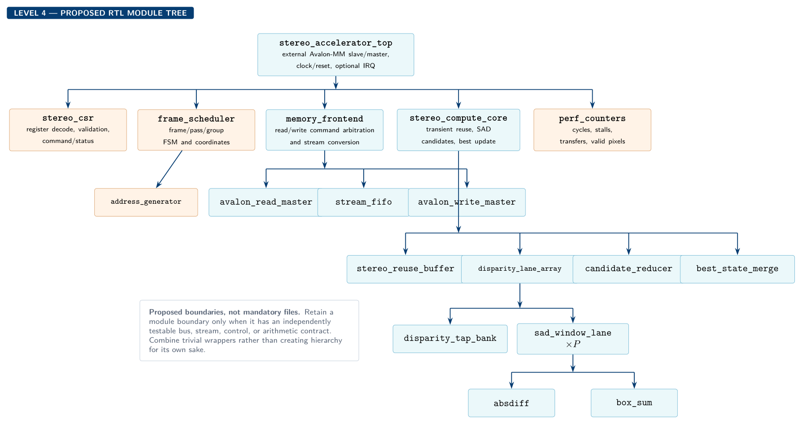

# Hardware workspace

The hardware is organized using the hierarchy in [`docs/design_hierarchy.md`](../docs/design_hierarchy.md). Do not place every function in one top-level RTL file, and do not create wrappers with no independently testable contract.



## Proposed source hierarchy

```text
hardware/
├── platform/       Platform Designer system, component packaging, clocks/resets
├── rtl/
│   ├── control/    CSR, scheduler, address generation, counters
│   ├── transport/  Avalon read/write masters and stream FIFOs
│   ├── compute/    reuse buffers, SAD lanes, reducer, best-state merge
│   └── top/        stereo accelerator top-level integration only
└── constraints/    board pin, clock, and timing constraints
```

Create these directories when their first real source file is added; empty placeholders are unnecessary.

## Proposed module boundaries

| Module | Responsibility | Required standalone proof |
|---|---|---|
| `stereo_csr` | CPU-visible configuration, command, status, and errors | ID/scratch/start/busy/done register test |
| `frame_scheduler` | Frame/pass/disparity-group sequencing | Tiny-frame FSM test with stalls |
| `address_generator` | Convert logical rows/regions into aligned bursts | Stride, alignment, first/last address test |
| `memory_frontend` | Isolate Avalon transactions from internal streams | Shared-SDRAM pass-through transform |
| `avalon_read_master` | Accepted read commands and ordered response stream | Random `waitrequest`/latency scoreboard |
| `avalon_write_master` | Output stream to accepted writes | Random write stalls and final-burst test |
| `stream_fifo` | `valid/ready` elasticity | Full/empty and simultaneous push/pop test |
| `stereo_reuse_buffer` | Raster pixels to aligned window/disparity taps | Ramp and impulse border tests |
| `disparity_lane_array` | Generate `P_LANES` SAD candidate pipelines | Equivalent results for `P=1,2,4` |
| `candidate_reducer` | Select group minimum with frozen tie rule | Ties and candidate permutations |
| `best_state_merge` | Merge group winner with prior SDRAM state | Better/worse/equal cost tests |
| `perf_counters` | Explain total, active, and stalled cycles | Simultaneous event and reset/snapshot test |
| `stereo_accelerator_top` | Connect verified child contracts | End-to-end tiny frame in simulation/FPGA |

These names are proposed boundaries. Combine blocks if there is no useful independent interface or test.

## Integration gates

1. **G0 — Contract:** freeze pixel, window, disparity, border, tie, state, and stream formats.
2. **G1 — Platform:** verify the intended external SDRAM region from Nios V.
3. **G2 — Control:** integrate and verify the CSR slave.
4. **G3 — Transport:** perform a custom-IP SDRAM read-transform-write pass under stalls.
5. **G4 — Pixel cost:** integrate one right tap and absolute-difference lane.
6. **G5 — Window SAD:** produce correct valid-region SAD costs for a tiny frame.
7. **G6 — Full search:** complete a bit-exact `P_LANES=1` disparity map.
8. **G7 — Scaling:** compile multiple lane counts and collect resource/timing/throughput results.
9. **G8 — Continuous:** process ping-pong/ring buffers and expose stable counters/demo output.

Preserve a known-good checkpoint after every gate. Retain source HDL, Platform Designer source/scripts, constraints, and reproducible build scripts; generated Quartus outputs remain ignored.
